# OpenEuler简介与开发环境配置
## OpenEuler简介
OpenAtom openEuler（简称“openEuler”） 社区是一个面向数字基础设施操作系统的开源社区。由开放原子开源基金会（以下简称“基金会”）孵化及运营。

openEuler 是一个面向数字基础设施的操作系统，支持服务器、云计算、边缘计算、嵌入式等应用场景，支持多样性计算，致力于提供安全、稳定、易用的操作系统。通过为应用提供确定性保障能力，支持 OT 领域应用及 OT 与 ICT 的融合。

openEuler 社区通过开放的社区形式与全球的开发者共同构建一个开放、多元和架构包容的软件生态体系，孵化支持多种处理器架构、覆盖数字基础设施全场景，推动企业数字基础设施软硬件、应用生态繁荣发展。

openEuler 作为一个操作系统发行版平台，其 LTS 版本为企业级用户提供一个安全稳定可靠的操作系统。

openEuler 也是一个技术孵化器。通过发布创新版，快速集成 openEuler 以及其他社区的最新技术成果，将社区验证成熟的特性逐步回合到发行版中。这些新特性以单个开源项目的方式存在于社区，方便开发者获得源代码，也方便其他开源社区使用。

社区中的最新技术成果持续合入社区发行版，社区发行版通过用户反馈反哺技术，激发社区创新活力，从而不断孵化新技术。发行版平台和技术孵化器互相促进、互相推动、牵引版本持续演进。

[来源][openEuler技术白皮书](https://www.openeuler.org/zh/showcase/technical-white-paper/)

## 开发环境配置
- [所需环境] Windows10及以后版本

### WSL
WSL（Windows Subsystem for Linux）是微软开发的一项技术，允许用户在Windows系统中直接运行完整的Linux环境，无需虚拟机。通过操作系统级虚拟化，WSL将Linux子系统无缝嵌入Windows，提供原生Linux命令行工具、软件包管理器及应用程序支持。它具有轻量化、文件系统集成、良好的交互性及开发效率提升等优点，消除了Windows与Linux之间的隔阂，尤其适合开发者和需在Windows平台上使用Linux工具的用户。


#### 为什么选择WSL
- 传统方式获取获取Linux等操作系统环境，需要安装完整的虚拟机，如VMware
- 使用WSL，可以采用非常轻量化的方式，得到开发环境

该项目作为参考展示，紧跟当下趋势，选择WSL 简单、快捷地获得openEuler系统。

#### WSL环境配置
1. 仅需要找到控制面版->程序->程序和功能->启用或关闭Windows功能 中找到“适用于Linux的Windows子系统”并启用这个功能，等待主机重启即可。
   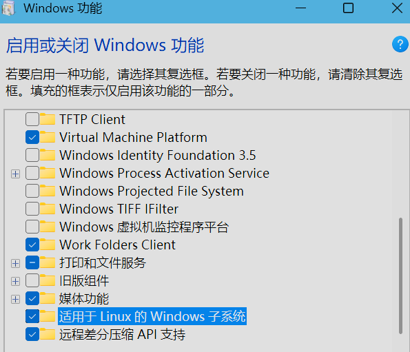
2. 可以在微软商店中找到openEuler，下载后启动进行配置用户与密码等即可
   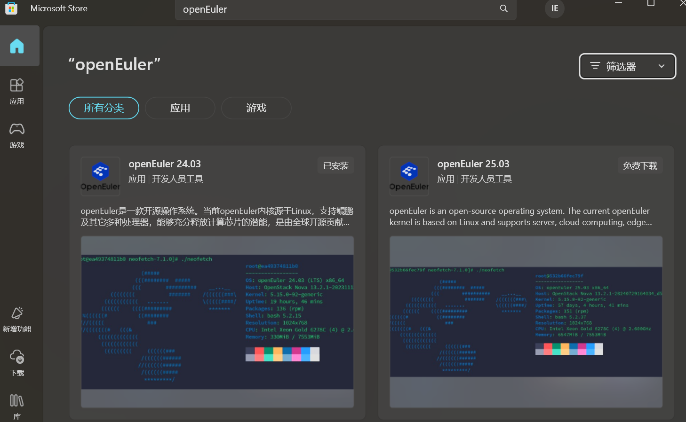

# OpenEulerAgent
## 项目&使用技术 介绍
本项目是一个基于 [Ollama](#ollama) + [RAGFlow](#ragflow) + [LangGraph](#langgraph) 实现的一个小型AI Agent教学引例。它旨在为操作系统学习提供一个安全、交互式的实践平台，并展示 AI 技术如何赋能专业知识教学。

## 项目流程图
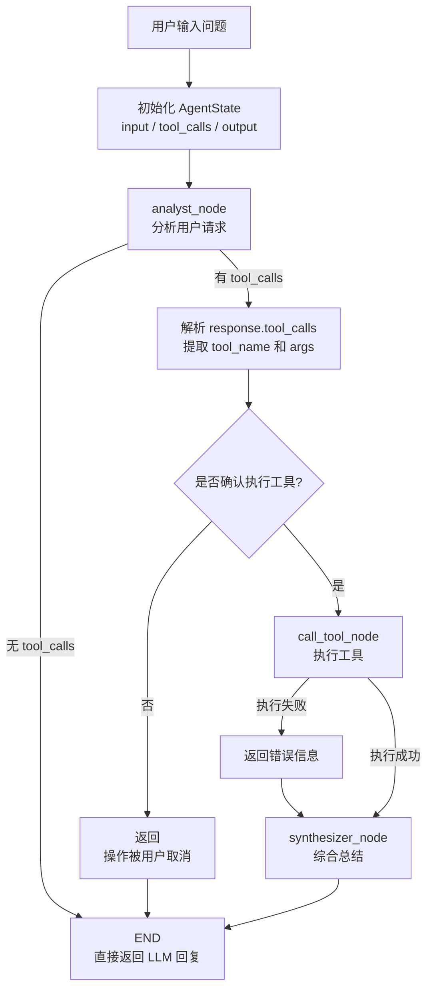

#### 核心价值与教学意义
- AI助手构建的学习:本项目简易地演示了如何使用 LangGraph 框架构建一个多工具协作的Agent。它是没有系统学习过AI的同学学习现代 AI Agent 架构和的绝佳实践。
- 操作系统学习:尽管以 openEuler 为基础，但其核心架构和安全设计理念具有极强的通用性。它只是作为引例，可以启发迁移和扩展到其他操作系统（如 Ubuntu、Windows）或任何需要安全实践环境和知识库支持的教学领域。
- 安全实践环境:通过 execute_safe_shell 工具实现严格的命令隔离和安全过滤，允许学习者在不破坏系统的前提下，安全地实践基础 Shell 操作和核心 OS 概念。
- 知识驱动的准确性:使用 RAGFlow 知识库进行事实核查，确保所有专业问题的解答都能基于权威资料，极大提高了教学内容的准确性。
## Ollama
### Ollama简介
Ollama是一款旨在简化大型语言模型本地部署和运行过程的开源软件。

Ollama提供了一个轻量级、易于扩展的框架，让开发者能够在本地机器上轻松构建和管理LLMs（大语言模型）。

通过Ollama，开发者可以导入和定制自己的模型，无需关注复杂的底层实现细节。

[Ollama官网](https://ollama.com/)
### Why Ollama
本地部署大模型：所有数据都在本地，不需要联网，无需担心**隐私泄露**

同时为后续**个性化知识库**提供便利。
### Ollama环境配置
1. 在官网中选择适合自己环境的Ollama版本  [下载链接](https://ollama.com/download)
   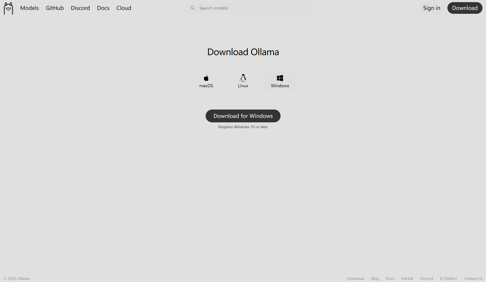
2. 下载安装完成后验证是否安装成功
   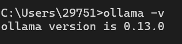
3.  在官网可自行选择本地部署的大模型或选择后续RAGflow所需要的Embedding大模型
    [官网提供的大模型](https://ollama.com/library)\
    该项目采用的大模型版本与后续Embedding大模型\
    [qwen3:1.7b](https://ollama.com/library/qwen3) &emsp; [qwen3-embedding:4b](https://ollama.com/library/qwen3-embedding)\
    按照右上角命令提示拉取模型到本地
    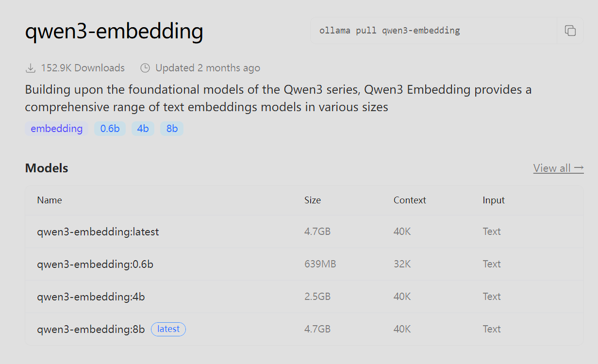\
    如图片所示(因为已经安装过，因此图片仅供参考)
    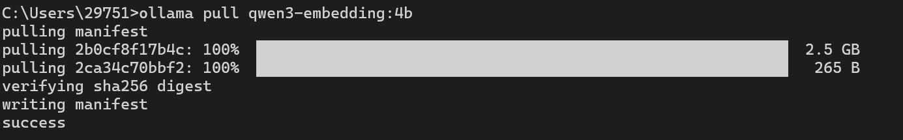\
    配置环境变量并重启主机
    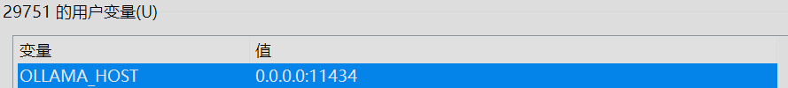\
    **注意:**\
    **若未配置环境变量，可能导致后续WSL虚拟环境访问不到主机中的ollama;**\
    **如果配置后虚拟环境无法访问，可能是本地防火墙拦截了端口11434;**\
    **不想直接暴露11434端口:SSH端口转发实现**
4.  可通过指令查询安装的模型
    ```shell
    ollama list
    ```
    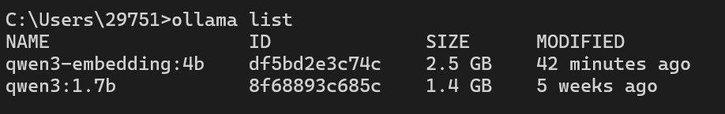

至此,ollama配置完成
## RAGflow
### RAGflow简介
RAGFlow 是一款领先的开源检索增强生成（RAG）引擎，通过融合前沿的 RAG 技术与 Agent 能力，为大型语言模型提供卓越的上下文层。

它提供可适配任意规模企业的端到端 RAG 工作流，凭借融合式上下文引擎与预置的 Agent 模板，助力开发者以极致效率与精度将复杂数据转化为高可信、生产级的人工智能系统。

[RAGflow官网](https://ragflow.io/)

[RAGflow Github](https://github.com/infiniflow/ragflow)
### Why RAG
为什么要使用RAG技术:大模型的**幻觉**问题

**RAG技术**:在大模型生成回答前，通过信息从外部知识库**检索**与问题相关的知识，**增强**生成过程中的信息来源，从而提高**生成**时的质量与准确性

**检索(Retrieval)**:当用户提出问题时，系统会从外部知识库中检索出与用户输入相关的内容。\
**增强(Augmentation)**:系统将检索到的信息与用户的输入相结合，扩展模型的上下文。然后再传给生成模型。\
**生成(Generation)**:生成模型基于增强后的输入生成最终的回答。由于这一回答参考了外部知识库中的内容，因此更加准确可读。

**简而言之，RAG相当于开卷考试，当用户输入内容后，大模型会查阅构建的知识库进行回答。**
### Embedding
Ollama中的qwen3:1.7b是为了本地部署的大语言模型，RAGflow是为了辅助构建知识库，实现RAG技术使用的，那么Embedding模型是用于什么的呢？

在RAG**检索**过程中，外部知识库可能是本地文件、搜索引擎结果、API等。知识库的文件在上传后需要对其**解析**。

**Embedding(嵌入)模型解析**:将自然语言转化为机器可以理解的高维向量，并且通过这一过程捕获到文本背后的语义信息(比如不同文本之间的相似度关系);\
同时，用户的输入也会经过Embedding处理，生成一个高维向量。生成的高维向量会去查询知识库中的文档片段，在这个过程中，系统会利用某些相似度度量去判断相似度。

模型的分类：Chat模型、Embedding模型

**简而言之，Embedding模型是用来对上传的文件进行解析的。**
### RAGflow配置
[下载RAGflow源码](https://github.com/infiniflow/ragflow) &emsp;[RAGflow安装参考](https://github.com/infiniflow/ragflow/blob/main/README_zh.md)

下载Docker &emsp;[Docker官网](https://www.docker.com/)

1. 首先使用git命令拉取RAGflow源码(若速度较慢，可直接下载zip文件)
   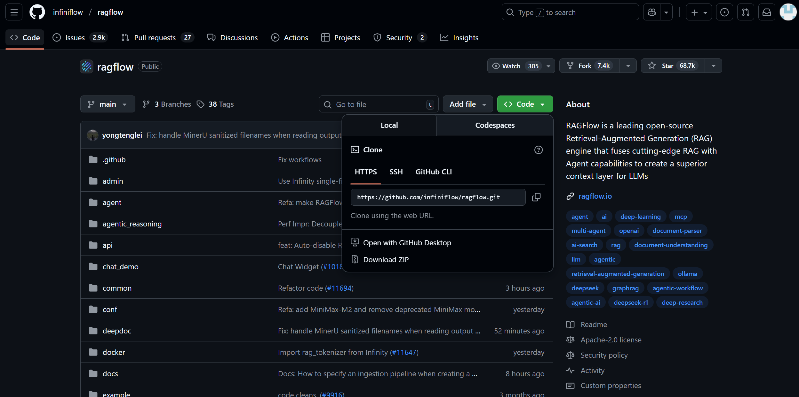

2. 选取合适的版本，下载Docker并**启用**
   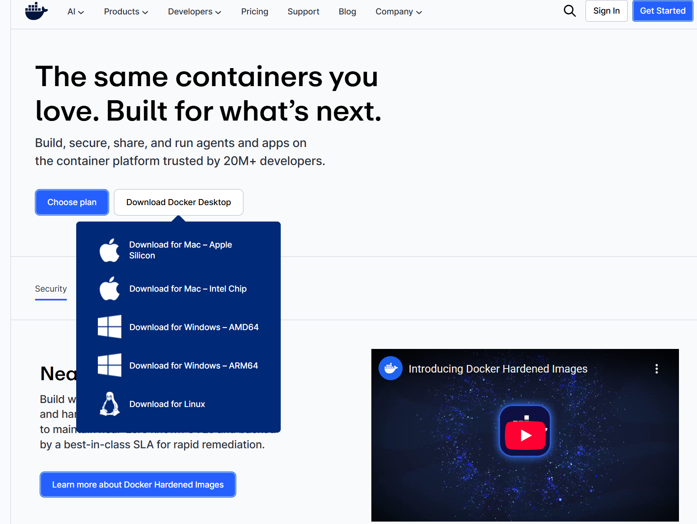

3. 打开RAGflow源码 ragflow-main->docker->.env，配置.env\
    1. 若主机有独立显卡，可选择设置gpu运行
       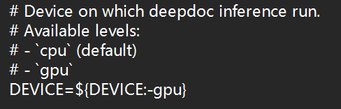
    2. 可配置分配给Docker的内存
       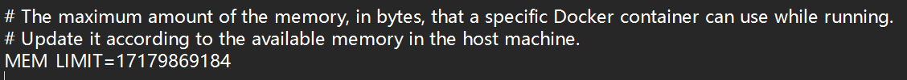
    3. 可以自行选择镜像版本(旧版slim不包含Embedding模型)
       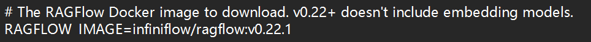

   配置完成这些基本设置，可以在当前docker文件夹打开cmd使用命令
    ```shell
    # Use CPU for DeepDoc tasks:
    docker compose -f docker-compose.yml up -d
    # To use GPU to accelerate DeepDoc tasks:
    # sed -i '1i DEVICE=gpu' .env
    # docker compose -f docker-compose.yml up -d
    ```
   由于已经安装过，因此图片仅供参考
   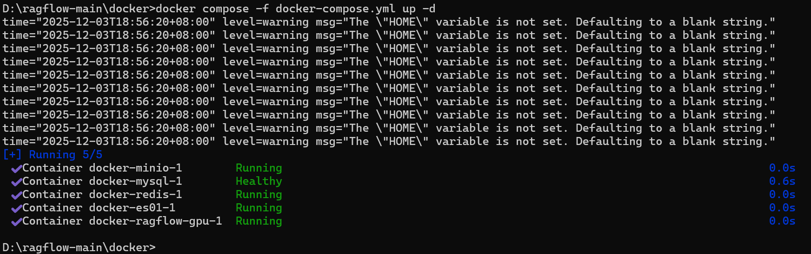
4. 正确下载安装后，浏览器内输入localhost:80可跳转至登录界面(浏览器默认为80端口，80可省略)
   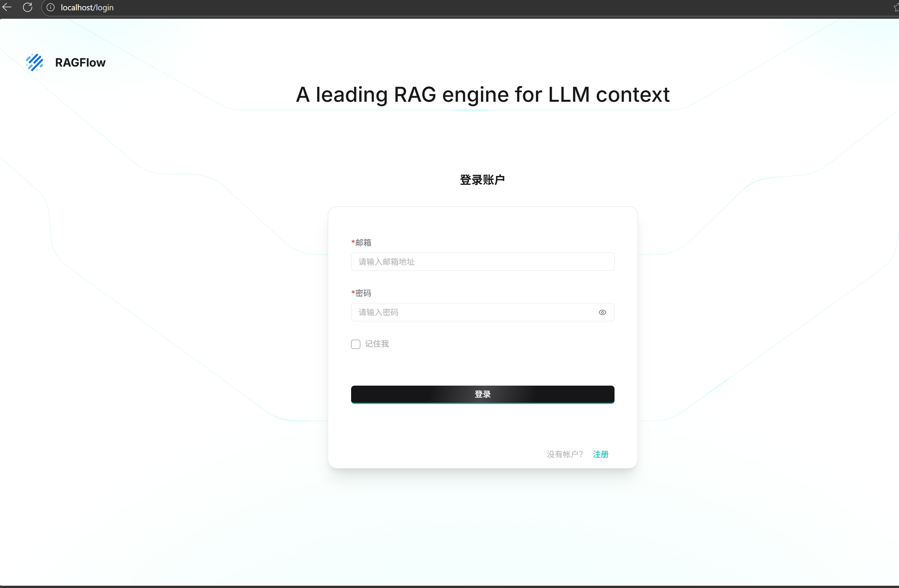
5. 注册登录后进行模型的配置,**名称**与下载模型ollama的名称**完全相同**;\
   **ipconfig**指令查看虚拟环境的**ip地址**;\
   **基础Url**填写http://虚拟环境ip地址:11434
   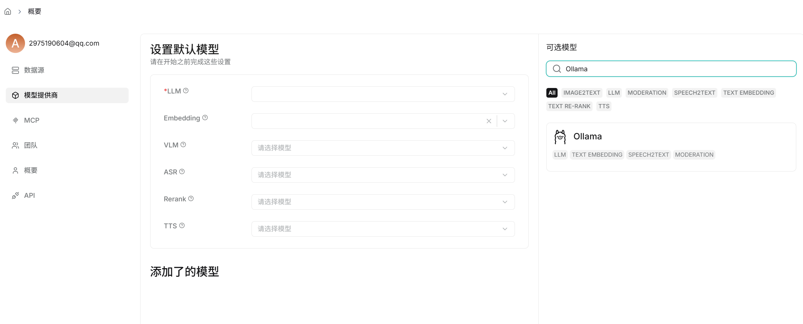
   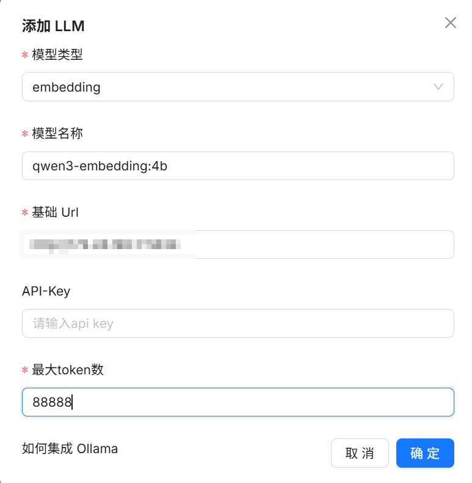
   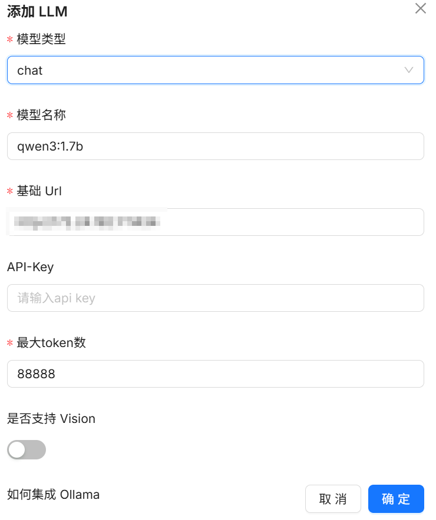
6. 创建一个知识库
   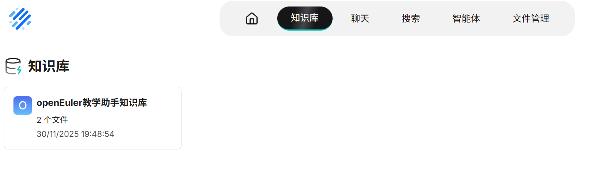
7. 进入知识库可上传自己的文本，并进行**解析**
   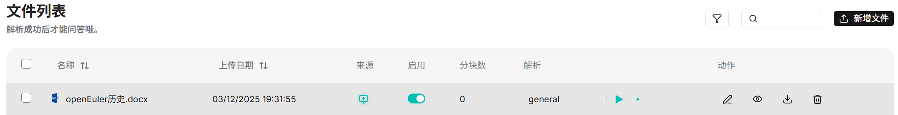

至此，RAGflow添加自己的本地知识库完成
## LangGraph
### LangGraph简介
LangGraph 是 LangChain 提供的一种用于构建多步骤 AI Agent 的工作流框架。它通过状态图的方式组织 Agent 的执行流程，将复杂的推理和工具调用过程拆分为多个节点，并使用边来描述节点之间的执行关系。
LangGraph 以统一的状态对象贯穿整个执行过程，使 Agent 的决策过程更加清晰、可控，也便于调试和扩展。

## 项目源代码分析 & 结果分析
### LLM层源码分析
1. 状态节点定义与初始化LLM
   ```python
   # --- 状态定义 ---
   class AgentState(BaseModel):
        input: str
        command: dict
        tool_calls: list
        output: str
        intermediate_steps: List[str]
    
   # --- 初始化 LLM ---
   try:
        #判断是否调用工具的LLM
        llm = Ollama(model=MODEL_NAME, base_url=OLLAMA_URL, temperature=0.0)
        llm_with_tools = llm.bind_tools(TOOLS)
        #用于总结的LLM
        llm_synthesize = Ollama(model=MODEL_NAME, base_url=OLLAMA_URL, temperature=0.2)
   except Exception as e:
        print(f"⚠️ 初始化失败：{e}")
        llm_with_tools = None
        llm_synthesize = None
   ```
   | 字段                 | 类型        | 说明                              |
       |--------------------|-----------|---------------------------------|
   | input              | str       | 用户输入的原始问题                       |
   | command            | dict      | 当前要执行的工具命令（包含工具名和参数）            |
   | tool_calls         | list      | LLM 建议调用的工具列表                   |
   | output             | str       | 节点输出结果                          |
   | intermediate_steps | List[str] | 记录各处理节点的中间操作步骤，用于追踪 Agent 的推理流程 |

   为了统一管理 Agent 的状态信息，定义了 AgentState 类，继承pydantic的BaseModel类，保证字段完整与类型一致性。通过该状态对象，可在 Agent 各处理节点之间安全、可追踪地传递信息。\
   系统初始化阶段，通过 Ollama 初始化两个 LLM：一个用于分析用户请求并自行判断是否调用工具（llm_with_tools），一个用于整合工具结果并生成自然语言回答（llm_synthesize）。初始化采用 try-except 异常处理，如果模型初始化失败，则将对应变量置为 None，后续节点通过判断 None 状态可安全处理错误，保证 Agent 的健壮性。\
   同时分析需求的LLM与总结的LLM设置不同的temperature，分析需求时使得LLM更保守确定，总结时略微升高以提高自然性与创意性。
2.  需求分析节点
    ```python
    #分析需求
    def analyst_node(state_analyst: AgentState) -> AgentState:
        if llm_with_tools is None:
            return AgentState(
                input="",
                tool_calls=[],
                command={},
                output="LLM 初始化失败",
                intermediate_steps=[],
            )
        print("\n[AGENT] 正在分析用户请求...")
        prompt = ChatPromptTemplate.from_messages([
            ("system", SYSTEM_PROMPT),
            ("human", state_analyst.input)
        ])
        response = llm_with_tools.invoke(prompt.invoke({}))
        steps = state_analyst.intermediate_steps.copy()
        if response.tool_calls:
            tool_call = response.tool_calls[0]
            steps.append(f"LLM 建议调用工具: {tool_call['name']}")
            return AgentState(
                input=state_analyst.input,
                tool_calls=response.tool_calls,
                command=dict(tool_call),
                output="",
                intermediate_steps=steps
            )
        else:
            return AgentState(
                input=state_analyst.input,
                tool_calls=[],
                command={},
                output=response.content,
                intermediate_steps=steps
            )
    ```
    1)首先检查LLM的初始化。\
    2)将状态节点的input与系统提示词SYSTEM_PROMPT构建为prompt，通过LangChain提供的统一调用的invoke函数进行封装输出，并记录下这一步的steps。\
    3)如果模型返回的tool_calls非空，则说明LLM建议调用工具，节点会返回工具调用状态；否则将模型生成的回答存入output并返回状态节点。

    **说明：response返回的是LangChain支持的AIMessage对象，其中有content、tool_calls(如果在上一步用bind_tools方法绑定了工具)等等参数，而tool_calls结果列表中的某一个具体工具又有一个字典保存了工具的name、args等参数。后续在代码分析中需要用到这些参数。**
3.  调用工具节点
    ```python
    def call_tool_node(state_call_tool: AgentState) -> AgentState:
        tool_call = state_call_tool.command
        tool_name = tool_call["name"]
        tool_args = tool_call["args"]
        tool_func = next((t for t in TOOLS if t.name == tool_name), None)
        if not tool_func:
            return AgentState(
                input="",
                tool_calls=[],
                command={},
                output=f"错误：找不到工具 {tool_name}",
                intermediate_steps=[]
            )
        print(f"待执行的操作: {tool_name}，参数: {tool_args}")
        if input("是否确定执行此操作？(yes/no): ").strip().lower() == 'yes':
            try:
                result = tool_func.invoke(tool_args)
                print(f"操作 `{tool_name}` 执行成功，准备总结。")
                return AgentState(
                    input=state_call_tool.input,
                    tool_calls=state_call_tool.tool_calls,
                    command=state_call_tool.command,
                    output=result,
                    intermediate_steps=state_call_tool.intermediate_steps
                )
            except Exception as ex:
                return AgentState(
                    input=state_call_tool.input,
                    tool_calls=state_call_tool.tool_calls,
                    command=state_call_tool.command,
                    output=f"工具执行出错: {ex}",
                    intermediate_steps=state_call_tool.intermediate_steps
                )
        else:
            return AgentState(
                input=state_call_tool.input,
                tool_calls=state_call_tool.tool_calls,
                command=state_call_tool.command,
                output="操作被用户取消。",
                intermediate_steps=state_call_tool.intermediate_steps
            )
    ```
    1)首先根据通过call_tool获取上一次传递过来的状态节点的command参数，并读取Agent建议的工具调用信息。获取工具的name与args参数。\
    2)从已注册的工具列表TOOLS中查找对应的工具名称存入tool_func，若未找到对应工具则赋值为None，并返回错误状态。\
    3)找到后进行用户的安全性确认，用户若取消操作则返回对应取消状态节点。若执行，则调用工具的invoke方法并传入args，工具返回的结果存入output，保存之前状态和中间步骤，方便后续使用。若异常则返回对应出错信息让Agent输出，保证程序不崩溃。
4.  总结节点
    ```python
    #综合总结
    def synthesizer_node(state_synthesizer: AgentState) -> AgentState:
        if llm_synthesize is None:
        return AgentState(
            input="",
            tool_calls=[],
            command={},
            output="总结 LLM 初始化失败",
            intermediate_steps=[]
        )
        print("\n[AGENT] 正在总结信息并生成回答...")
        retrieval_result = state_synthesizer.output
        original_input = state_synthesizer.input
        synthesis_prompt = ChatPromptTemplate.from_messages([
            ("system", SYSTEM_PROMPT2),
            ("human", f"原始问题: {original_input}\n\n--- 参考材料 ---\n{retrieval_result}")
        ])
        response = llm_synthesize.invoke(synthesis_prompt.invoke({}))
        return AgentState(
            input=state_synthesizer.input,
            tool_calls=[],
            command={},
            output=response.content,
            intermediate_steps=state_synthesizer.intermediate_steps
        )
    ```
    1)首先检查用于总结的LLM初始化是否成功。\
    2)获取前一个状态输出的output作为参考资料，并构建一个新的prompt，将原始问题与参考材料结合。\
    3)使用invoke方法调用LLM生成综合回答并返回状态节点。
5.  图的构建与main函数
    ```python
    # --- 图构建 ---
    def initialize_graph():
        if llm_with_tools is None: return None
        workflow = StateGraph(AgentState)
        workflow.add_node("analyst", analyst_node)
        workflow.add_node("tool_executor", call_tool_node)
        workflow.add_node("synthesizer", synthesizer_node) # 新增总结节点
        workflow.set_entry_point("analyst")
        workflow.add_conditional_edges(
            "analyst",
            lambda s: "tool_executor" if s.tool_calls else END,
                {"tool_executor": "tool_executor", END: END}
        )
        workflow.add_edge("tool_executor", "synthesizer")
        workflow.add_edge("synthesizer", END)
        return workflow.compile()
    app = initialize_graph()
    if __name__ == "__main__":
    print(f"--- openEuler 教学助理 ({MODEL_NAME}) ---")
    while True:
        q = input("\n[AGENT]请问你想问什么？ (exit退出): ")
        if q.lower() == 'exit': break
        initial_state=AgentState(
            input=q,
            tool_calls=[],
            command={},
            output="",
            intermediate_steps=[]
        )
        try:
        state = app.invoke(initial_state)
            if state and state.get('output'):
                print("\n========== 回答 ==========")
                print(state['output'])
        except Exception as e:
            print(f"\n出错:{e}")
    ``` 
    1)构建图，通过set_entry_point构造进入节点，每次都从analyst节点开始。\
    2)使用lambda s判断状态，如果tool_calls非空则进入tool_executor节点，否则直接结束。\
    3)增加普通边。\
    4)编译图并在main函数中生成完整了LangGraph Agent。
### TOOL层源码分析
1.  RAGFlow初始化与基础指令调用工具
    ```python
    # --- RAGFlow 客户端初始化 ---
    RAGFLOW_CLASS = ragflow_sdk.RAGFlow
    RAGFLOW_CLIENT = None
    if RAGFLOW_CLASS is not None:
        try:
            RAGFLOW_CLIENT = RAGFLOW_CLASS(
                base_url=RAGFLOW_API_BASE,
                api_key=RAGFLOW_API_KEY
            )
        except Exception as e:
            print(f"RAGFlow 客户端初始化失败 (请检查 API BASE 和 KEY): {e}")
    # --- 1. 基础 Shell 工具 ---
    @tool
    def execute_safe_shell(command: str) -> str:
        print(f"\n[AGENT] 尝试执行命令: {command}")
        dangerous_keywords = ['rm', 'mv', 'reboot', 'shutdown', 'systemctl', 'useradd', 'passwd', 'mkfs', 'chown', 'chmod', 'dd']
        if any(keyword in command for keyword in dangerous_keywords):
            return "ERROR: 拒绝执行此命令。此工具仅允许执行查询或状态检查等安全命令。"
        try:
            result = subprocess.run(
                command,
                shell=True,
                check=True,
                capture_output=True,
                text=True,
                timeout=10,
            )
            return result.stdout.strip()
        except Exception as ex:
            return f"命令执行过程中发生错误: {ex}"
    ```
    1)初始化RAGFlow客户端。\
    2)执行基础shell指令时定义了危险操作，避免执行这些操作。\
    3)通过python的subprocess模块进行子进程的创建并执行外部指令，并检测异常(通过check退出码)、设置时间限制防止卡死(timeout)，并返回输出为字符串(text)。
2.  C语言教学工具(只允许运行已编译的文件)
    ```python
    # --- 2. C 语言教学演示工具 ---
    @tool
    def run_teaching_demo(program_name: str, arguments: str = "") -> str:
        current_dir = os.path.dirname(os.path.abspath(__file__))
        DEMO_PATH = os.path.abspath(os.path.join(current_dir, "../OpenEuler基础"))
        clean_name = program_name.lower().replace(".c", "").replace("-", "_")
        exe_name_kebab = clean_name.replace('_', '-')
        exe_name_snake = clean_name
        if os.path.exists(os.path.join(DEMO_PATH, exe_name_kebab)):
            exe_full_path = os.path.join(DEMO_PATH, exe_name_kebab)
            exe_name = exe_name_kebab
        elif os.path.exists(os.path.join(DEMO_PATH, exe_name_snake)):
            exe_full_path = os.path.join(DEMO_PATH, exe_name_snake)
            exe_name = exe_name_snake
        else:
            return (f"错误：在目录中找不到与 '{clean_name}' 匹配的已编译可执行文件。\n"
            f"请确保文件 '{exe_name_kebab}' 或 '{exe_name_snake}' 存在于 {DEMO_PATH} 中。")
            print(f"[AGENT] 确定可执行文件: '{exe_name}'")
        try:
            subprocess.run(
                ["chmod", "+x", exe_full_path],
                check=True,
                capture_output=True,
                text=True
            )
        except Exception as ex:
            return f"错误：无法设置可执行文件权限 ({exe_name})。请检查用户权限设置: {ex}"
        try:
            run_cmd = f"stdbuf -oL {exe_full_path} {arguments}"
            print(f"[AGENT] 准备执行：{run_cmd}")
            result = subprocess.run(
                run_cmd,
                shell=True,
                check=True,
                capture_output=True,
                text=True,
                timeout=10
            )
            return f"程序运行成功。\n\n程序输出:\n{result.stdout.strip()}"
        except subprocess.TimeoutExpired as ex:
            stdout_output = ex.stdout.strip() if ex.stdout else "无输出内容"
            stderr_output = ex.stderr.strip() if ex.stderr else "无错误信息"
            return (f"程序运行完成（触发超时保护，这对无限循环程序是正常的）。\n"
                    f"在 {ex.timeout} 秒内的运行输出如下:\n\n"
                    f"--- 标准输出 (stdout) ---\n{stdout_output}\n\n"
                    f"--- 标准错误 (stderr) ---\n{stderr_output}")
        except subprocess.CalledProcessError as ex:
            return (f"程序运行时崩溃 (非零退出)。\n"
                    f"错误信息 (Stderr):\n{ex.stderr}")
        except Exception as ex:
            return f"运行阶段发生未知错误: {ex}"
    ```
    1)调用目录“OpenEuler基础”里的文件，并且输入时允许人与LLM输入的不确定性(如producer-consumer,producer_consumer,producer-consumer.c)。\
    2)用chmod增加文件的权限。\
    3)调用执行对应程序，通过stdbuf -oL按行刷新标准输出，使LLM可以获得输出。
3.  RAGFlow知识库调用，最后导出工具列表
    ```python
    # --- 3. RAGFlow 知识库检索工具 ---
    @tool
    def search_knowledge_base(question: str) -> str:
        if RAGFLOW_CLIENT is None:
            return "RAGFlow 客户端未成功初始化，无法执行检索。"
        try:
            response = RAGFLOW_CLIENT.retrieve(
            question=question,
            dataset_ids=[RAGFLOW_DATASET_ID],
            top_k=3,
            similarity_threshold=0.5
            )
            chunks_data = []
            if isinstance(response, list):
                chunks_data = response
            elif isinstance(response, dict):
                chunks_data = response.get('data', {}).get('chunks', []) # 字典里是 dicts 或 Chunk objects
            chunks = []
            if isinstance(chunks_data, list):
            for item in chunks_data:
                try:
                    content = item.content
                    if content:
                        chunks.append(content)
                except AttributeError:
                    if isinstance(item, dict) and item.get('content'):
                        chunks.append(item.get('content'))
            # === 结果处理 ===
            if chunks:
                result_text = "\n\n--- 检索到的参考资料 ---\n".join(chunks)
                return f"查询成功，参考资料如下:\n{result_text}"
            else:
                return "知识库未找到与该问题高度相关的参考资料。"
        except Exception as ex:
            return f"RAGFlow 调用失败: {ex}"
    TOOLS = [execute_safe_shell, run_teaching_demo, search_knowledge_base]
    ```
    1)通过RAGFlow提供的retrieve方法,通过传递的question参数，通过dataset_ids查询指定的知识库，top_k返回最相似的前k个文档，并把相似度小于0.5的过滤掉。\
    2)获取到的文档片段数据可能是列表或字典，进行兼容处理，最终返回纯文本输出。\
    3)导出所有工具列表。
### 结果分析
1. 基础职责\
   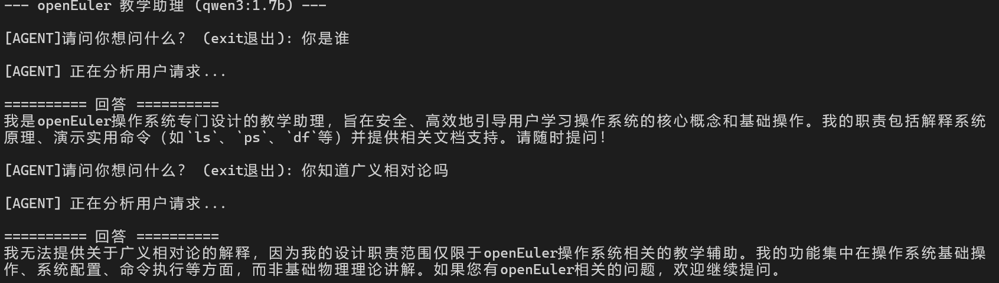
2. 基础指令演示\
   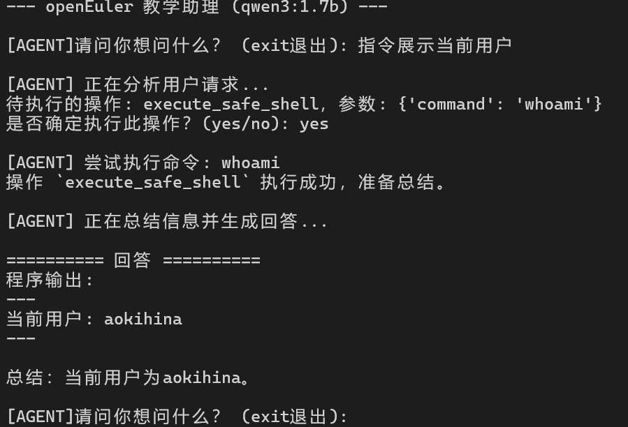
   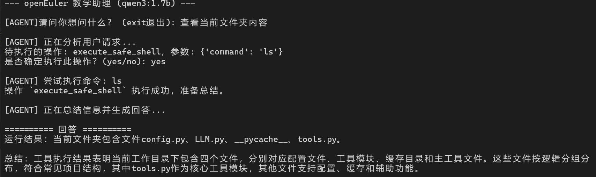
   3教学C语言程序\
   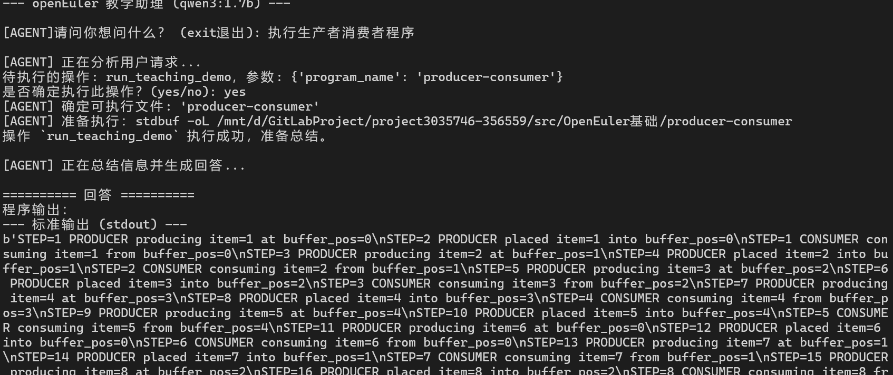
   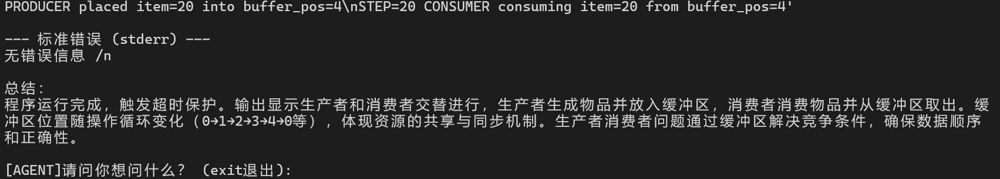
   4知识库调用\
   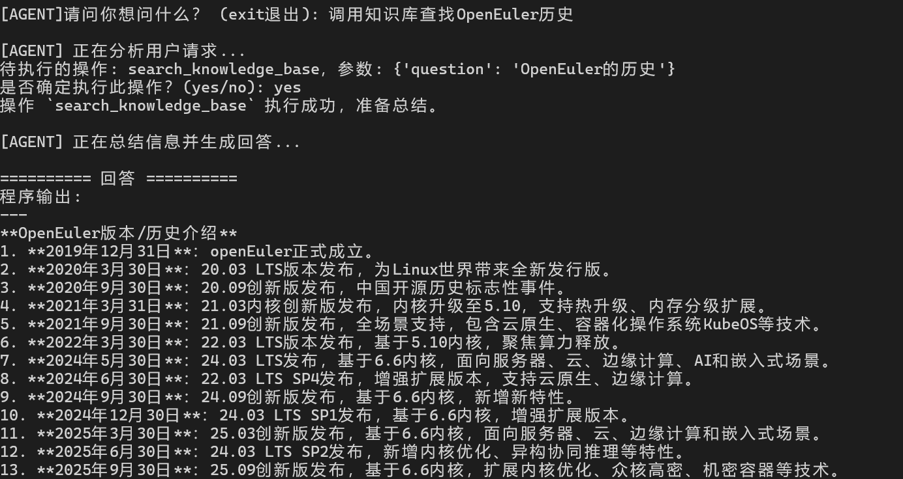
   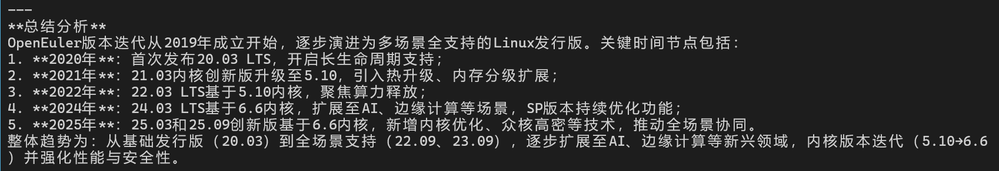
## 项目改进建议
| 现状                                    | 问题描述                               | 改进措施                                                                   |
|---------------------------------------|------------------------------------|------------------------------------------------------------------------|
| LLM 分析程序输出或直接总结时，有时仍会产生幻觉（胡编数据、表格或逻辑） | 提示词还不够严格，缺乏结构化约束，面对无限循环或复杂输出容易臆造内容 | 1. 严格分层提示词：安全约束、输出解析、教学解释等<br> 2. 结合结构化输出<br>3. 使用微调(如`LoRA`技术)        |
| 只能分析有print输出的程序                       | 无法处理需要用户输入或交互的程序                   | 1. 增加标准输入模拟工具 <br>2. 改写示例程序，使输入参数可通过命令行或函数参数传递 <br>3. 对交互式程序使用示例输入进行分析 |
| 输出结构化不足                               | 无法直接用于统计、绘图或教学材料                   | 1. 将输出结构化为 JSON/CSV<br>2. LLM 直接解析结构化数据，而不是自由文本                        |
| 安全性                                   | shell 工具已限制，但未来增加新工具可能存在风险         | 1. 定期复审工具列表及命令限制，确保不执行高风险操作                                            |
| 项目可扩展性                                | 未来支持多 OS、不同实验或语言程序可能受限             | 1. 抽象工具接口<br>2. 统一日志和输出格式<br>3. 支持插件式实验模块                              |